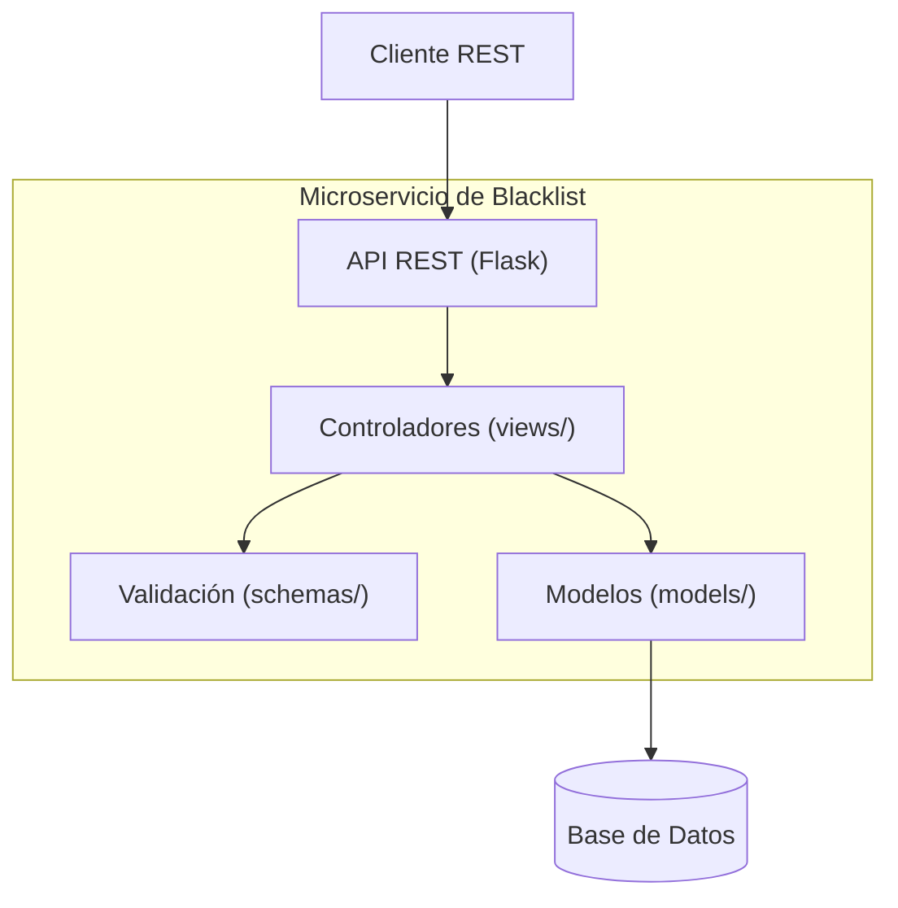
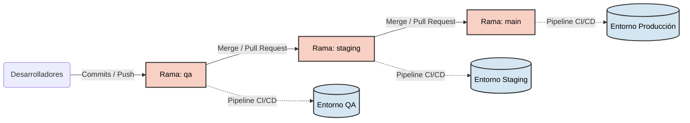
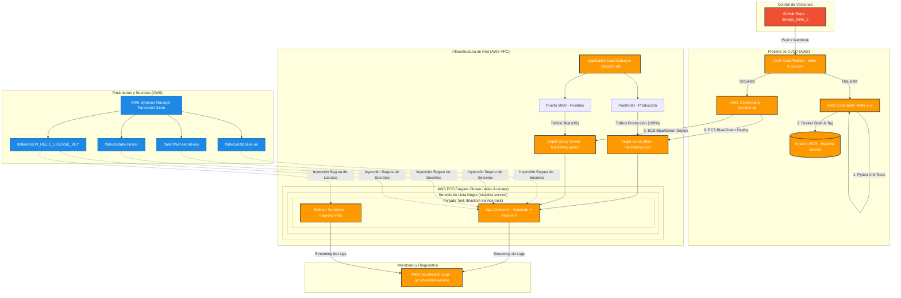
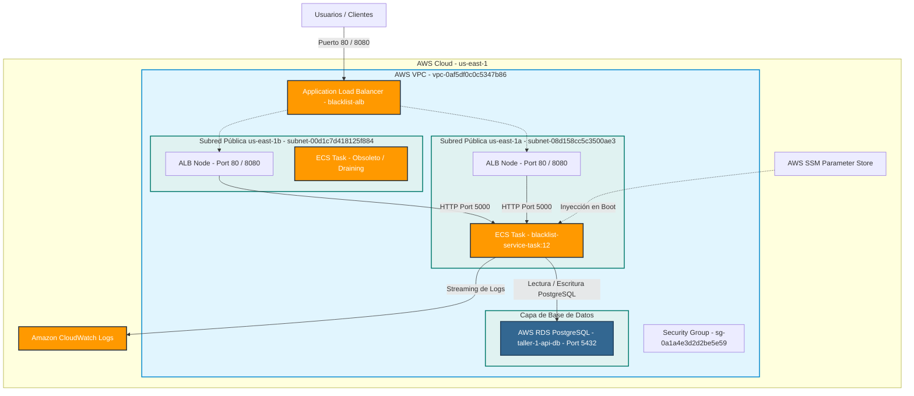
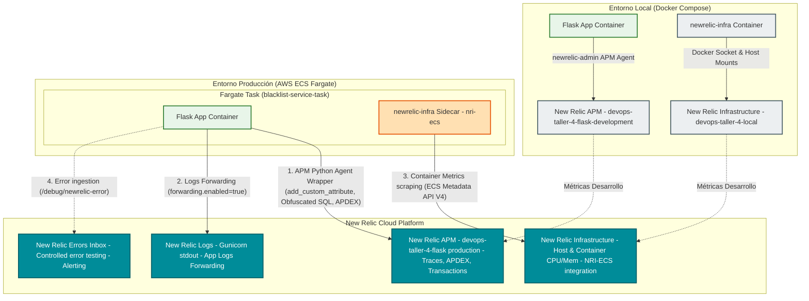

# Fuente de Actividades CI/CD - DevOps

## Grupo: The Last One

- Integrante: Breitner Enrique Gonzalez Angarita
- Codigo: 202217107
- Correo: b.gonzalez@uniandes.edu.co

Este repositorio contiene el código fuente y las configuraciones de todas las entregas y talleres prácticos de la materia de DevOps. Incluye la creación del microservicio, configuración de pruebas, integración continua (CI) y despliegue continuo (CD) usando AWS.

## Componentes principales del Proyecto

| Archivo / Directorio | Propósito |
|---|---|
| `src/` | Código fuente del microservicio Flask (modelos, esquemas, vistas). |
| `tests/` | Tests unitarios con `pytest` para garantizar la calidad del código. |
| `Dockerfile` | Configuración para contenerizar el microservicio. |
| `docker-compose.yml` | Orquestación local del servicio. |
| `buildspec.yml` | Receta de AWS CodeBuild para la etapa de construcción, pruebas y creación de imagen Docker. |
| `appspec.yaml` | Configuración para AWS CodeDeploy (Despliegue Blue/Green en ECS). |
| `task-def.json` | Definición de tareas para AWS ECS Fargate. |
| `requirements.txt` | Dependencias del proyecto en Python. |
| `newrelic.ini` | Configuración versionada del agente New Relic sin license key. |
| `scripts/stress_test.js` | Escenario k6 para generar tráfico y analizar New Relic. |

## Estructura del Proyecto

```
devops_taller_3/
|-- application.py            # Punto de entrada de la aplicación
|-- Dockerfile                # Receta de la imagen Docker
|-- docker-compose.yml        # Configuración para ejecutar con Docker a nivel local
|-- requirements.txt          # Dependencias de Python
|-- buildspec.yml             # <-- AWS CodeBuild config
|-- appspec.yaml              # <-- AWS CodeDeploy config
|-- task-def.json             # <-- AWS ECS Task Definition
|-- newrelic.ini              # <-- Configuración APM de New Relic
|-- pytest.ini                # Configuración de pytest
|-- src/                      # Código base del microservicio
|   |-- main.py
|   |-- models/
|   |-- schemas/
|   `-- views/
|-- tests/                    # Pruebas unitarias
|   |-- conftest.py
|   |-- test_health.py
|   |-- test_blacklist_post.py
|   `-- test_blacklist_get.py
`-- scripts/                  # Scripts útiles para hooks de despliegue
    |-- pre_deployment.sh
    |-- post_deployment.sh
    `-- stress_test.js
```

### Diagrama de Componentes



## Ejecución del proyecto

### Ejecución Local (Sin Docker)

1. Crear un entorno virtual y activarlo:
   ```bash
   python -m venv venv
   source venv/bin/activate  # En Windows usar: venv\Scripts\activate
   ```

2. Instalar las dependencias:
   ```bash
   pip install -r requirements.txt
   ```

3. Ejecutar la aplicación:
   ```bash
   python application.py
   ```
   *La aplicación estará disponible en `http://localhost:5000`*

4. Ejecutar las pruebas localmente:
   ```bash
   pytest --cov=src --cov-report=term-missing
   ```

### Ejecución Local (Con Docker)

1. Construir e iniciar los contenedores en segundo plano:
   ```bash
   docker-compose up -d --build
   ```

2. La aplicación estará disponible en `http://localhost:5000`.

3. Para ver los logs de los contenedores:
   ```bash
   docker-compose logs -f
   ```

4. Para detener y eliminar los contenedores:
   ```bash
   docker-compose down
   ```

## Monitoreo continuo con New Relic

La aplicación queda instrumentada con el agente Python de New Relic y se ejecuta con Gunicorn mediante `newrelic-admin run-program`, que es la forma recomendada para que el agente se inicialice antes de los workers.

### Variables locales

En local uso `.env.local` para cargar la licencia y las variables de New Relic. Ese archivo no debe versionarse.

Variables esperadas:

```bash
NEW_RELIC_LICENSE_KEY=<ingest_license_key>
NEW_RELIC_APP_NAME=devops-taller-4-flask
NEW_RELIC_ENVIRONMENT=development
NEW_RELIC_CONFIG_FILE=/app/newrelic.ini
NEW_RELIC_LOG=stdout
NEW_RELIC_LOG_LEVEL=info
NEW_RELIC_DISTRIBUTED_TRACING_ENABLED=true
```

### Variables en AWS Fargate

En AWS no guardo la licencia en archivos ni en la imagen Docker. La tarea de ECS la recibe desde AWS Systems Manager Parameter Store:

```text
/taller4/NEW_RELIC_LICENSE_KEY
```

El archivo `task-def.json` inyecta ese parámetro como `NEW_RELIC_LICENSE_KEY` en el contenedor de la aplicación y como `NRIA_LICENSE_KEY` en el sidecar `newrelic-infra`.

### Validación rápida

1. Levantar localmente:
   ```bash
   docker compose up --build
   ```
2. Generar tráfico:
   ```bash
   for i in $(seq 1 50); do curl -s http://localhost:5002/ping; done
   ```
3. Revisar el endpoint seguro de configuración:
   ```bash
   curl http://localhost:5002/observability/newrelic
   ```
4. Verificar en New Relic APM la aplicación `devops-taller-4-flask (development)`.

### Pruebas de stress

Con k6:

```bash
BASE_URL=http://localhost:5002 TOKEN=uniandes-devops-2026 k6 run scripts/stress_test.js
```

Para Fargate, cambiar `BASE_URL` por el DNS del ALB. Yo uso esta ejecución para capturar evidencias de tiempo de respuesta, DB, Apdex, errores y alertas.

### Error controlado para sustentación

El endpoint `/debug/newrelic-error` está apagado por defecto. Si necesito demostrar Errors Inbox en una prueba controlada, activo:

```bash
ENABLE_ERROR_TEST_ENDPOINT=true
```

Después ejecuto `GET /debug/newrelic-error` y vuelvo a dejar la variable en `false`.

## Flujo de CI/CD (AWS)

1. **Integración Continua (CI):** Un push a la rama principal o configurada dispara el pipeline. AWS CodeBuild (mediante `buildspec.yml`) ejecuta las pruebas unitarias, construye la imagen de Docker y la publica en Amazon ECR.
2. **Despliegue Continuo (CD):** AWS CodePipeline toma la nueva imagen y a través de AWS CodeDeploy actualiza el servicio en AWS ECS (Fargate). Se utiliza una estrategia de despliegue Blue/Green para asegurar una transición sin interrupciones ni tiempos de inactividad (Zero Downtime).

### Diagrama de Despliegue y Ramas (Flujo de Trabajo)



## Pruebas con Postman

En la raíz del repositorio se encuentra el archivo `postman_collection.json`, el cual se puede importar directamente en Postman para probar todos los endpoints y visualizar ejemplos de respuestas de error y éxito.

### Detalles de la API

La colección incluye las variables necesarias para funcionar. Los endpoints protegidos usan un token estático configurado en las variables de entorno de la aplicación.

*   **Token (Bearer Token):** `uniandes-devops-2026`
*   **Base URL (Local):** `http://localhost:5000` (El puerto por defecto de Flask. Si usas Docker, valida el mapeo de puertos).

### Endpoints Disponibles

#### 1. Health Check (Público)
*   **Método:** `GET`
*   **Ruta:** `/ping`
*   **Descripción:** Endpoint público que responde con un estado de salud (`{"status": "ok"}`) y un timestamp.

#### 2. Service Info (Público)
*   **Método:** `GET`
*   **Ruta:** `/`
*   **Descripción:** Retorna el nombre del servicio.

#### 3. Agregar Email a la Lista Negra (Privado)
*   **Método:** `POST`
*   **Ruta:** `/blacklists`
*   **Autenticación:** Bearer Token
*   **Headers:** `Content-Type: application/x-www-form-urlencoded`
*   **Body:**
    *   `email`: El email que deseas bloquear.
    *   `app_uuid`: Identificador único de la app solicitante (ej. `11111111-1111-1111-1111-111111111111`).
    *   `blocked_reason`: (Opcional) Motivo por el cual fue bloqueado.

#### 4. Consultar si un Email está en la Lista Negra (Privado)
*   **Método:** `GET`
*   **Ruta:** `/blacklists/{email}`
*   **Autenticación:** Bearer Token
*   **Descripción:** Verifica si el email provisto en la URL existe en la lista negra. Retorna un booleano `in_blacklist` y el `blocked_reason` si aplica.

## Arquitecturas del Sistema

### 1. Arquitectura de Despliegue en AWS (Blue/Green)

El siguiente diagrama detalla la arquitectura de despliegue continuo en la nube de AWS configurada para el microservicio de lista negra, incluyendo el flujo desde el repositorio de GitHub hasta los servicios administrados de AWS ECS Fargate, el balanceador de carga ALB y la inyección segura de secretos.



### 2. Arquitectura de Infraestructura en AWS

El siguiente diagrama detalla la arquitectura puramente de infraestructura y redes en AWS. Muestra la VPC, la distribución de subredes públicas y privadas, el ruteo a través del balanceador de carga ALB, el rol del grupo de seguridad, las tareas del clúster de ECS Fargate y la conexión directa a la base de datos relacional AWS RDS PostgreSQL:



### 3. Arquitectura de Monitoreo con New Relic

El siguiente diagrama presenta cómo se integra New Relic en el microservicio tanto a nivel de agente APM (para trazas, transacciones de Flask y logs enriquecidos del servidor de aplicación) como a nivel de infraestructura Fargate (mediante la recolección activa de métricas del sidecar `nri-ecs`), cubriendo tanto el entorno local como el productivo en la nube.




