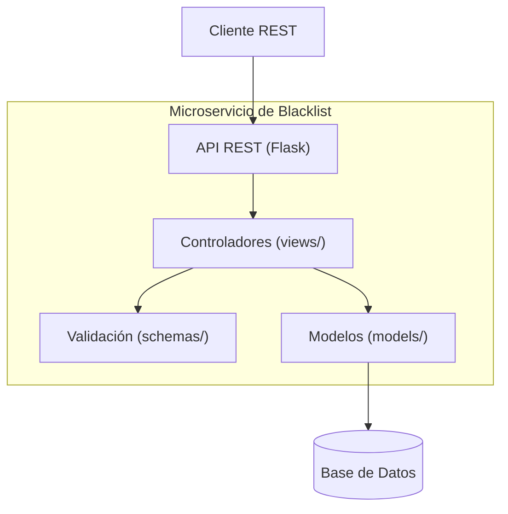
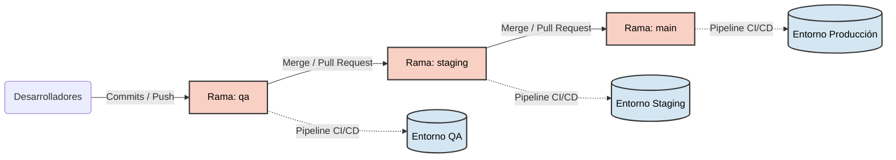

# Fuente de Actividades CI/CD - DevOps

## Grupo: The Last One

- Integrante: Breitner Enrique Gonzalez Angarita
- Codigo: 202217107
- Correo: b.gonzalez@uniandes.edu.co

Este repositorio contiene el código fuente y las configuraciones de todas las entregas y talleres prácticos de la materia de DevOps. Incluye la creación del microservicio, configuración de pruebas, integración continua (CI) y despliegue continuo (CD) usando AWS.

## Componentes principales del Proyecto

| Archivo / Directorio | Propósito |
|---|---|
| `src/` | Código fuente del microservicio Flask (modelos, esquemas, vistas). |
| `tests/` | Tests unitarios con `pytest` para garantizar la calidad del código. |
| `Dockerfile` | Configuración para contenerizar el microservicio. |
| `docker-compose.yml` | Orquestación local del servicio. |
| `buildspec.yml` | Receta de AWS CodeBuild para la etapa de construcción, pruebas y creación de imagen Docker. |
| `appspec.yaml` | Configuración para AWS CodeDeploy (Despliegue Blue/Green en ECS). |
| `task-def.json` | Definición de tareas para AWS ECS Fargate. |
| `requirements.txt` | Dependencias del proyecto en Python. |

## Estructura del Proyecto

```
devops_taller_3/
|-- application.py            # Punto de entrada de la aplicación
|-- Dockerfile                # Receta de la imagen Docker
|-- docker-compose.yml        # Configuración para ejecutar con Docker a nivel local
|-- requirements.txt          # Dependencias de Python
|-- buildspec.yml             # <-- AWS CodeBuild config
|-- appspec.yaml              # <-- AWS CodeDeploy config
|-- task-def.json             # <-- AWS ECS Task Definition
|-- pytest.ini                # Configuración de pytest
|-- src/                      # Código base del microservicio
|   |-- main.py
|   |-- models/
|   |-- schemas/
|   `-- views/
|-- tests/                    # Pruebas unitarias
|   |-- conftest.py
|   |-- test_health.py
|   |-- test_blacklist_post.py
|   `-- test_blacklist_get.py
`-- scripts/                  # Scripts útiles para hooks de despliegue
    |-- pre_deployment.sh
    `-- post_deployment.sh
```

### Diagrama de Componentes



## Ejecución del proyecto

### Ejecución Local (Sin Docker)

1. Crear un entorno virtual y activarlo:
   ```bash
   python -m venv venv
   source venv/bin/activate  # En Windows usar: venv\Scripts\activate
   ```

2. Instalar las dependencias:
   ```bash
   pip install -r requirements.txt
   ```

3. Ejecutar la aplicación:
   ```bash
   python application.py
   ```
   *La aplicación estará disponible en `http://localhost:5000`*

4. Ejecutar las pruebas localmente:
   ```bash
   pytest --cov=src --cov-report=term-missing
   ```

### Ejecución Local (Con Docker)

1. Construir e iniciar los contenedores en segundo plano:
   ```bash
   docker-compose up -d --build
   ```

2. La aplicación estará disponible en `http://localhost:5000`.

3. Para ver los logs de los contenedores:
   ```bash
   docker-compose logs -f
   ```

4. Para detener y eliminar los contenedores:
   ```bash
   docker-compose down
   ```

## Flujo de CI/CD (AWS)

1. **Integración Continua (CI):** Un push a la rama principal o configurada dispara el pipeline. AWS CodeBuild (mediante `buildspec.yml`) ejecuta las pruebas unitarias, construye la imagen de Docker y la publica en Amazon ECR.
2. **Despliegue Continuo (CD):** AWS CodePipeline toma la nueva imagen y a través de AWS CodeDeploy actualiza el servicio en AWS ECS (Fargate). Se utiliza una estrategia de despliegue Blue/Green para asegurar una transición sin interrupciones ni tiempos de inactividad (Zero Downtime).

### Diagrama de Despliegue y Ramas (Flujo de Trabajo)



## Pruebas con Postman

En la raíz del repositorio se encuentra el archivo `postman_collection.json`, el cual se puede importar directamente en Postman para probar todos los endpoints y visualizar ejemplos de respuestas de error y éxito.

### Detalles de la API

La colección incluye las variables necesarias para funcionar. Los endpoints protegidos usan un token estático configurado en las variables de entorno de la aplicación.

*   **Token (Bearer Token):** `uniandes-devops-2026`
*   **Base URL (Local):** `http://localhost:5000` (El puerto por defecto de Flask. Si usas Docker, valida el mapeo de puertos).

### Endpoints Disponibles

#### 1. Health Check (Público)
*   **Método:** `GET`
*   **Ruta:** `/ping`
*   **Descripción:** Endpoint público que responde con un estado de salud (`{"status": "ok"}`) y un timestamp.

#### 2. Service Info (Público)
*   **Método:** `GET`
*   **Ruta:** `/`
*   **Descripción:** Retorna el nombre del servicio.

#### 3. Agregar Email a la Lista Negra (Privado)
*   **Método:** `POST`
*   **Ruta:** `/blacklists`
*   **Autenticación:** Bearer Token
*   **Headers:** `Content-Type: application/x-www-form-urlencoded`
*   **Body:**
    *   `email`: El email que deseas bloquear.
    *   `app_uuid`: Identificador único de la app solicitante (ej. `11111111-1111-1111-1111-111111111111`).
    *   `blocked_reason`: (Opcional) Motivo por el cual fue bloqueado.

#### 4. Consultar si un Email está en la Lista Negra (Privado)
*   **Método:** `GET`
*   **Ruta:** `/blacklists/{email}`
*   **Autenticación:** Bearer Token
*   **Descripción:** Verifica si el email provisto en la URL existe en la lista negra. Retorna un booleano `in_blacklist` y el `blocked_reason` si aplica.
